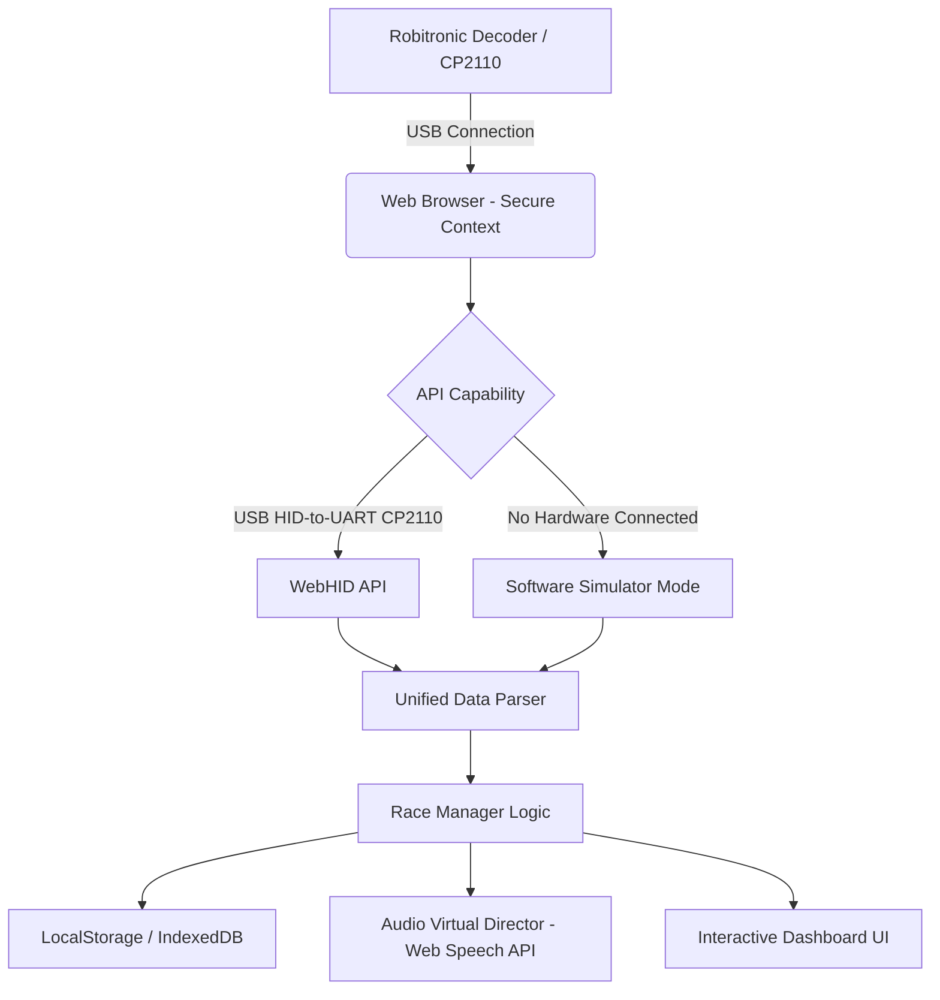

# Requirements: RC Lap Counter (Robitronic Compatible)

This document captures the requirements, system architecture, and technical specifications for a static web application designed to act as a lap counter and race manager for home RC car tracks (especially for 1/28 scale racing, such as Kyosho Mini-Z).

---

## 1. Project Goals & Architecture

### 1.1 Goal
Create a modern, feature-rich, and visually stunning timing system inspired by **Next Level Timing**. The software will run entirely client-side, making it easy to host as a static page on GitHub Pages, while maintaining local-first storage and high reliability.

**Primary Use Case**: Lappr's initial focus is the "home practice" environment. In these casual settings, cars (and their embedded transponders) are frequently shared across multiple drivers. Tracking long-term statistics and personal records across these specific Driver + Car combinations is a top priority. The application prioritizes fluidly remapping drivers to cars on the fly.

### 1.2 System Architecture


### 1.3 Tech Stack
- **Frontend Core**: HTML5 (Semantic elements), Vanilla ES6+ JavaScript, CSS3.
- **Styling**: Vanilla CSS utilizing CSS Custom Properties, modern Flexbox/Grid layouts, glassmorphism (`backdrop-filter`), and dynamic transitions/animations.
- **Hardware Integration**: WebHID API.
- **Speech Synthesis**: Web Speech API (`window.speechSynthesis`).
- **Data Persistence**: LocalStorage and IndexedDB (via local wrapper/Dexie.js).
- **Deployment**: Static site hosting (GitHub Pages) with PWA support (Service Worker) for offline capability.

---

## 2. Hardware Interface & Protocol Specification

The app must parse data from Robitronic compatible decoders using the CP2110 HID-to-UART bridge. These systems detect infrared (IR) transponders and relay data to the PC.

### 2.1 Robitronic PC Serial Protocol
When a transponder crosses the sensor loop, the decoder validates the signal internally and immediately transmits a **16-byte ASCII hex packet** over UART:

```
[Transponder ID (6 hex chars)][Timestamp (8 hex chars)]\r\n
```

#### Byte Allocation:
1. **Bytes 1–6 (Hex String)**: The 24-bit transponder ID.
   - *Example*: `CDFD4C` in hex converts to `13499724` in decimal.
2. **Bytes 7–14 (Hex String)**: The hardware timer value at crossing.
   - *Precision*: The timer increments in **1/4 millisecond (0.25 ms) ticks** (MSB first).
   - *Example*: `00FFB6DA` in hex is `16,758,490` ticks. 
   - *Calculation*: `16,758,490 * 0.25 ms = 4,189,622.5 ms` (approx. 70 minutes of run time).
3. **Bytes 15–16 (Control Characters)**: Carriage return (`\r`) and Line feed (`\n`).

### 2.2 Browser API Integration Paths
To support the hardware natively in the browser:
1. **WebHID API**: Used for decoders built with the **Silicon Labs CP2110 HID-to-UART bridge**. Because the CP2110 exposes itself as a USB HID class rather than a COM port, the app must claim the device and send/receive raw 64-byte HID reports according to Silicon Labs *AN434* specifications to establish UART communication.
2. **Mock/Simulator Driver**: A built-in driver that simulates transponder crossings (configurable trigger rate, randomized lap times, and customizable transponder IDs) to enable offline development and UI testing.

---

## 3. Core Functional Requirements

### 3.1 Session Modes
- **Practice Mode**:
  - Quick-start with zero configuration.
  - Automatically records laps for any detected transponder ID.
  - Makes it easy to remap drivers and cars live, during a practice session, allowing fluid car-sharing.
  - Keeps track of: Session time, total laps, last lap, personal best (PB) lap, average lap, consistency percentage, and 3-consecutive-fastest laps.
  - Reset and export functions.
- **Race / Qualifying Mode**:
  - Setup parameters: Race Name, Duration (Time-based, e.g., 5 minutes, or Lap-based, e.g., 50 laps), Warmup time, Delay start.
  - Start sequence: F1-style starting lights (5 red lights turning on sequentially, then going out with a starting buzzer).
  - Handles false starts (sensor crossing before the buzzer).
  - Leaderboard is sorted by total laps, then by total elapsed race time.
  - Final race standings showing gaps, fastest laps, and consistency.

### 3.2 Racer & Profile Database
- Store profiles locally using client-side storage:
  - **Racer Name**: String.
  - **Transponder ID**: 6-character hex string (mapped to the user).
  - **Color Tag**: For visual distinction on the leaderboard.
  - **Vehicle / Class Info**: E.g., "Mini-Z RWD", "Stock 2WD".
- Unregistered Transponder Capture: If an unmapped transponder crosses the line, display a floating notification with an "Assign to Racer" button to quickly register it on the fly.

### 3.3 Audio "Virtual Director"
Using the browser's native **Web Speech API**, the app will announce events in real-time:
- **Lap Callouts**: "Driver [Name], [Lap Time] seconds."
- **Fastest Lap**: "New overall fast lap by [Name], [Lap Time] seconds!"
- **Personal Best**: "Personal best for [Name]!"
- **Race Progress**: "2 minutes remaining", "Final lap for [Name]!", "Race finished!"
- **Streaks**: Announcements for achieving consecutive fast laps (e.g., "3 consecutive fast laps for [Name]!").
- *Configuration*: Users can toggle voice callouts on/off, adjust volume, pitch, rate, and choose which details to read (e.g., only call out fast laps).

---

## 4. UI & UX Requirements

To deliver a premium experience, the application's interface must look highly professional and offer immediate readability.

### 4.1 Visual Styling & Theme
- **Color Palette**: Curated dark theme. Deep obsidian background (`#0d0e12`), translucent cards (`rgba(20, 22, 28, 0.7)` with `backdrop-filter: blur(16px)`), and neon highlights:
  - Neon Violet (`#8b5cf6`) for primary branding.
  - Electric Teal (`#06b6d4`) for UI accents.
  - Emerald Green (`#10b981`) for personal bests.
  - Gold Yellow (`#f59e0b`) for active/leading status.
- **Typography**: Clean, high-legibility sans-serif fonts (e.g., *Inter* or *Outfit* imported from Google Fonts). Monospaced font for lap times to prevent text jitter during updates.
- **Micro-Animations**:
  - Smooth card insertion and sorting transitions.
  - Pulse animations for active connection status.
  - Vibrant hover effects for buttons and cards.

### 4.2 Layouts & Responsive Modes
- **Control Dashboard**: Split screen containing race controls (connect, start, settings) on the left, and the live leaderboard on the right.
- **Pit Lane Big-Board (HUD Mode)**: A full-screen, high-contrast, uncluttered view showing the top 3-5 racers in massive typography, optimized for viewing from several yards away while driving.
- **Mobile Responsive**: Optimized view for tablets and smartphones placed next to the track.

---

## 5. Non-Functional Requirements & Deployment

### 5.1 Static Hosting Compatibility
- The application must compile to single-page static files (HTML, CSS, JS) that can be hosted directly on GitHub Pages.
- No backend server required for standard operation.

### 5.2 Offline Capability (PWA)
- Implement a Service Worker to cache static assets (HTML, CSS, JS, fonts, sound effects).
- Create a `manifest.json` so the app can be "installed" on a tablet or desktop computer and run 100% offline without an active internet connection.

### 5.3 Local-First Data Security
- All race history, racer profiles, and settings are saved automatically in the user's browser.
- Include a "Backup & Restore" feature allowing users to export their database as a JSON file and import it on another device.
